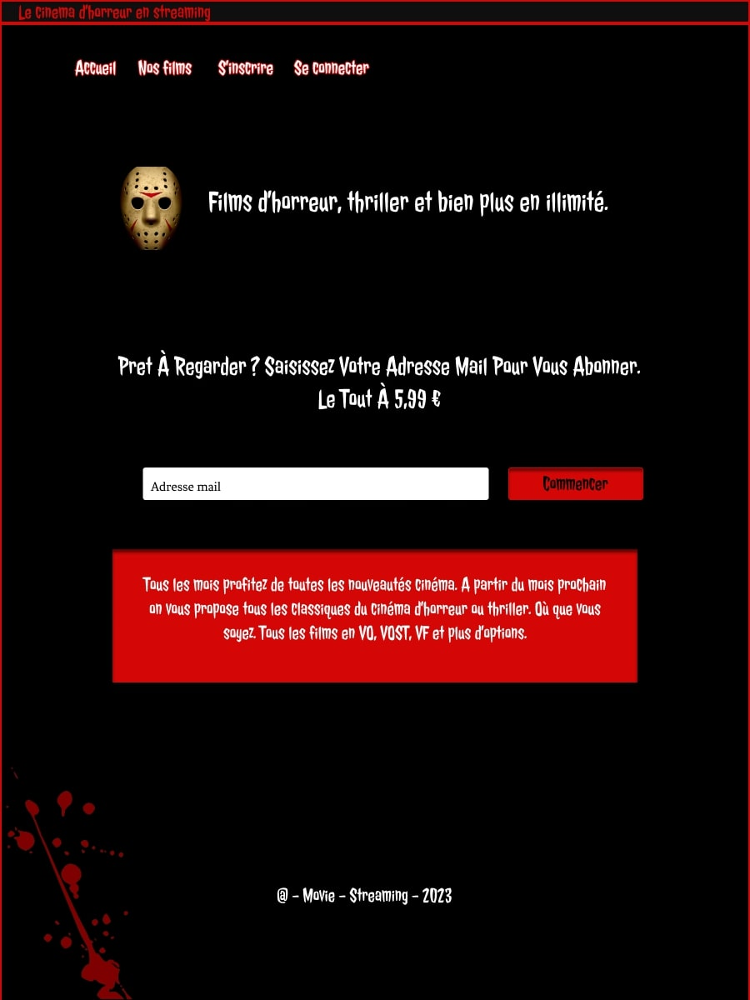
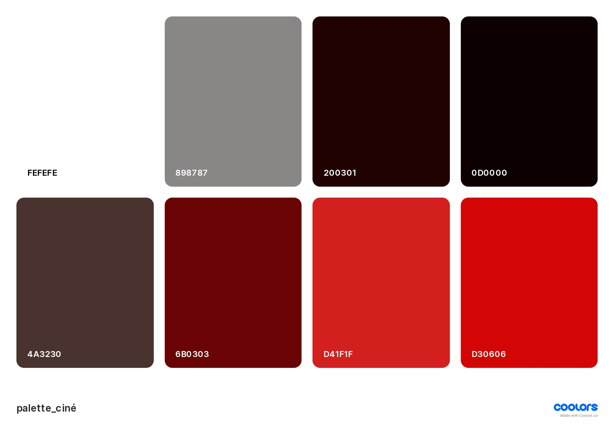
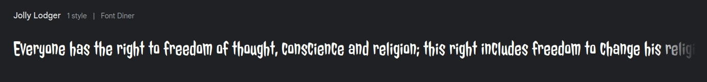

# Projet Streaming Horreur

# Présentation du projet streaming horreur
> Nous devons faire face à la réalité : La télévision telle que nous la connaissons est en train de changer lentement. De plus en plus de plateformes de streaming proposent désormais des séries télévisées. Nous pensons donc que ce n'est pas l'avenir, mais déjà le présent ! 
>
> Le projet proposé est donc un service de streaming qui propose une grande variété de séries TV primées, de films d'horreurs et plus encore sur des milliers d’appareils connectés à Internet. Vous pouvez regarder autant que vous le souhaitez, quand vous le souhaitez, sans aucune publicité. Il y a toujours quelque chose de nouveau à découvrir, et de nouvelles séries TV et films sont ajoutés chaque semaine !

>

>Rejoignez nous en cliquant ici : [streaming](https://lusegar.github.io/Proj-cin-/index.html)

# Palette couleur du projet

>

# Polices de caractères

>

>Projet initial pour apprendre les bonnes pratiques et rendre performante &amp; inclusive une application

> &copy;  [Lucas SEGGAR] - All rights reserved for educational purposes only
